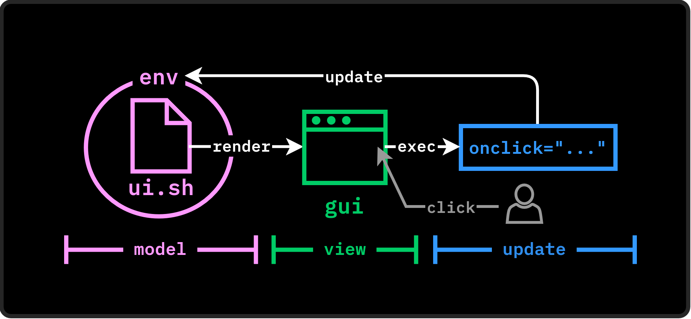

# How It Works

# The Concept: MVU

Designing an application with Shine simply consists of describing your interface in a specific XML format (*Shin's XML*, that will be called *SXML*) using a Shell script.

The strength of this approach lies in the fact that your interface is built directly by a script.
To build your view, you are completely free to leverage all the logic of the Shell (such as if conditions or while loops),
use your usual CLI tools, read your environment variables, traverse your file system, or execute any system command.

By default, your generation script produces a single SXML payload, which corresponds to a static page.
However, Shine allows you to create reactive interfaces. To achieve this, each user interaction first triggers the execution of a Shell callback,
and then immediately restarts the main generation script to rebuild and update the interface on the screen.

## Model : Persistent Shell Session

To maintain the application's consistency and store a "state" (the _Model_ in _MVU_), you could technically write data to files and read them back during the next generation. However, this method proves to be a bit heavy.

To simplify state management, Shine uses a single Shell environment that remains persistent throughout the lifetime of the application.
This persistence makes it very easy to store Shell variables (with a simple `export VAR=val`), and these variables automatically remain accessible during subsequent generations of the interface. 

So the _Model_ in Shine is the combination of the interface description (the `ui.sh` generation script) and the execution environment called `env` in which the shell runs (comprising environment variables, disk files, aliases, functions, tools, etc.).

# SXML (Shine XML)

To define graphical interfaces, Shine uses SXML, a strict dialect based on XML syntax.
While it adheres to standard XML formatting rules (opening/closing tags, attributes),
SXML imposes its own architectural constraints required for the MVU (Model-View-Update) pattern to function properly.

You can only use the native tags and components recognized by the Shine engine. The complete list of allowed tags, their attributes, and their behavior is available in the [SXML Tags]() doc section.

# The Lifecycle (The MVU Model)

Shine's reactive mechanism is based on the MVU (Model-View-Update) architecture. This model is broken down very simply into three key concepts

### 1. Generation (Model)

Shine executes your generation script `ui.sh` within the `env`. The script writes the XML interface description to a temporary file (`$OUTPUT`).

### 2. GUI Interpretation (View)

The Shine engine parses the XML file produced in step 1 and creates the corresponding GUI.

### 3. Interaction and Callbacks (Update)

When the user interacts with the GUI, the event triggers a callback. This callback is executed within the `env` so it can edit it (changing env variables, creating files, etc.).

As soon as a callback is executed, Shine automatically restarts the loop at Step 1 to update the display according to the new `env`.

